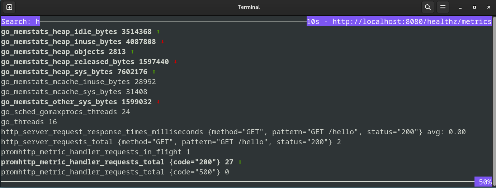

# promtui

CLI for "tailing" a Prometheus metrics-endpoint (potentially useful for debugging purposes).



## Install

Install with `go`:

```sh
go install github.com/sebogh/promtui/cmd/promtui@latest
```

or see [releases](https://github.com/sebogh/promtui/releases/latest)

## Usage

Run like: 

```sh
./promtui 
``` 

which will tail the metrics from the default endpoint: `http://localhost:9090/metrics`.

See `./promtui --help` for all available options.
